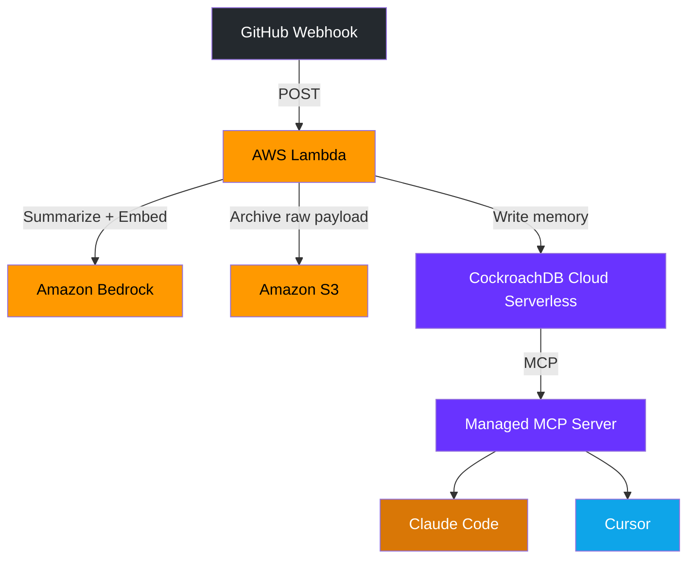

# Kepa

> A memory layer for coding agents that persists decisions and bug fixes in CockroachDB and retrieves them via MCP.

[](LICENSE)
[](https://cockroachlabs.cloud)
[](https://aws.amazon.com/bedrock/)

*Built for the CockroachDB × AWS Hackathon by Akash Naickar*

## Overview

Every day, teams solve hard bugs and make architectural decisions in PRs — then forget about them. That context is invisible to the coding agents that could benefit from it most.

Kepa gives coding agents (Claude Code, Cursor, etc.) persistent memory:

1. **Capture** — A GitHub webhook fires on PR merge or review. An AWS Lambda receives the payload, calls Amazon Bedrock to summarize and embed it, then writes the structured "memory" to CockroachDB.
2. **Store** — CockroachDB Cloud Serverless holds every memory with vector-indexed embeddings for semantic search and JSONB metadata for flexible querying.
3. **Recall** — Agents query memories through CockroachDB's Managed MCP Server. Ask: *"What do we know about the null pointer in user service?"* and get back the exact fix from weeks ago.

## Architecture

<!-- TODO: Replace with a proper diagram image once the flow is finalized -->



## Repository Structure

```
kepa/
├── infra/
│   └── schema.sql            # CockroachDB memory table + vector index
├── capture/
│   ├── handler.py            # Lambda function (Python 3.11)
│   ├── iam-policy.json       # Least-privilege IAM policy
│   └── s3-bucket.sh          # S3 bucket creation script
├── recall/
│   └── README.md             # MCP config for Claude Code + Cursor
├── demo-repo/
│   └── README.md             # Throwaway repo for the live demo
├── .env.example              # Required environment variables
├── .gitignore
├── LICENSE                   # Apache 2.0
└── README.md
```

## Prerequisites

- [ ] [CockroachDB Cloud](https://cockroachlabs.cloud) Serverless cluster with Managed MCP Server enabled
- [ ] AWS account with [Bedrock model access](https://console.aws.amazon.com/bedrock/) (Titan Embed + Titan Text or Claude)
- [ ] [Python 3.11+](https://www.python.org/)
- [ ] [AWS CLI](https://docs.aws.amazon.com/cli/latest/userguide/getting-started-install.html) configured
- [ ] GitHub repo with webhook configured
- [ ] Claude Code or Cursor (MCP client side)

## Setup

### 1. Clone and configure

```bash
git clone https://github.com/AkashNaickar/Kepa.git
cd Kepa
cp .env.example .env
# Fill in your credentials in .env
```

### 2. CockroachDB

Create a Serverless cluster, enable the Managed MCP Server, and run the schema migration:

```bash
cockroach sql --url "$DATABASE_URL" -f infra/schema.sql
```

### 3. S3 Bucket

```bash
bash capture/s3-bucket.sh            # uses your AWS account ID as suffix
# or:
bash capture/s3-bucket.sh my-bucket us-west-2
```

### 4. Lambda

<!-- TODO: Add SAM/CDK template for one-command deploy -->

1. Create a Lambda function with the **Python 3.11** runtime
2. Upload `capture/handler.py` as the function code
3. Attach the IAM policy from `capture/iam-policy.json`
4. Set environment variables from `.env`
5. Create a Function URL or API Gateway trigger

### 5. GitHub Webhook

In your repo → **Settings → Webhooks → Add webhook**:

- **Payload URL**: your Lambda endpoint from step 4
- **Content type**: `application/json`
- **Secret**: same as `GITHUB_WEBHOOK_SECRET` in `.env`
- **Events**: Pull requests, Pull request reviews

### 6. Wire up your agent

See [`recall/README.md`](recall/README.md) for Claude Code and Cursor MCP config.

## Running the Demo

### Quick local test (no AWS needed)

```bash
python capture/handler.py
```

Runs the full pipeline with stub implementations — no real API calls, just log output for each step.

### End-to-end

1. Configure `.env` with real credentials and deploy (steps 2–5 above)
2. Open a PR in `demo-repo/` with a commit like: *"fix: null pointer in user service when email is missing"*
3. Merge the PR → webhook fires → Lambda → Bedrock → CockroachDB
4. Ask your agent: *"What do we know about fixing the null pointer in user service?"*
5. The agent queries CockroachDB via MCP and returns the captured memory

## CockroachDB Tools Used

- **CockroachDB Cloud Serverless** — zero-ops storage, auto-scaling
- **Managed MCP Server** — exposes the `memory` table as MCP tools for agents
- **`VECTOR(1536)` + IVFFlat index** — semantic similarity search over embeddings
- **`JSONB` columns** — flexible metadata (author, PR title, S3 keys)
- **`STRING[]` arrays** — file path filtering
- **`CHECK` constraints** — enforces valid event types at the DB level

## AWS Services Used

- **AWS Lambda** — stateless webhook handler, orchestrates the capture pipeline
- **Amazon Bedrock** — summarization (Titan Text / Claude) + 1536-dim embeddings (Titan Embed)
- **Amazon S3** — archives raw diffs and PR bodies
- **AWS IAM** — least-privilege role scoped to Bedrock InvokeModel + one S3 bucket

## License

Made by Akash Naickar

Apache 2.0 — see [LICENSE](LICENSE) for details.
